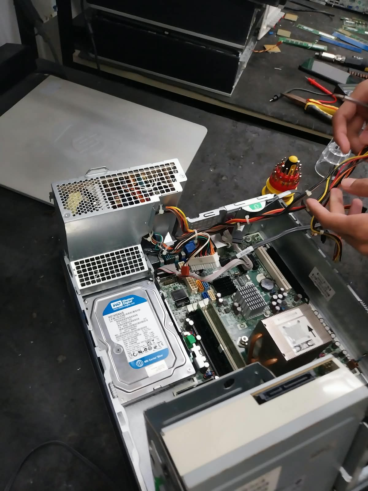
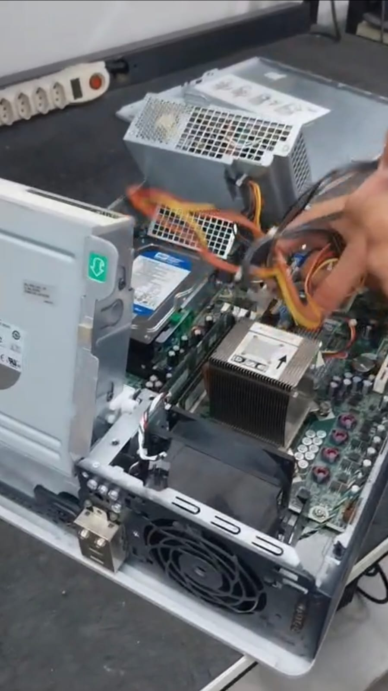
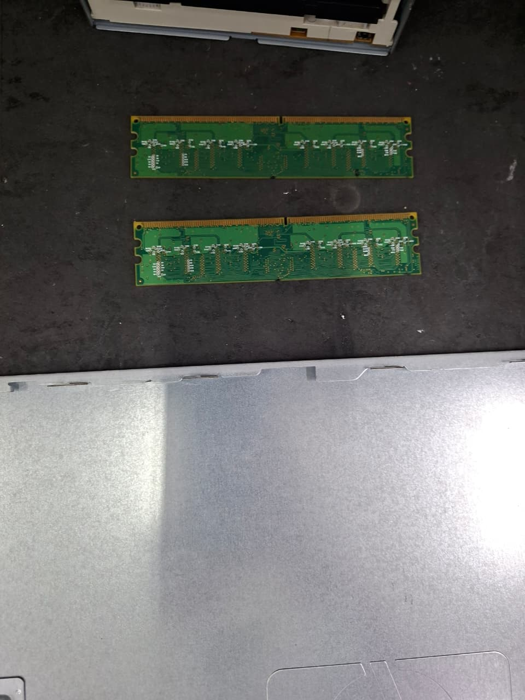
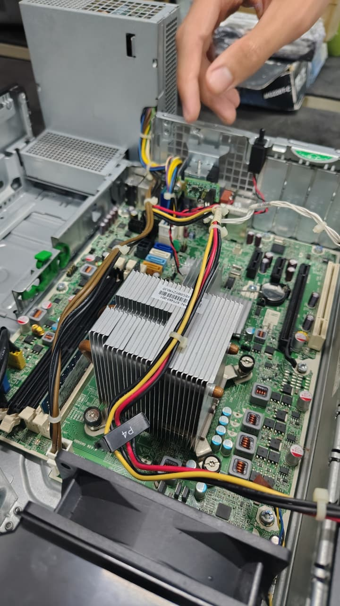
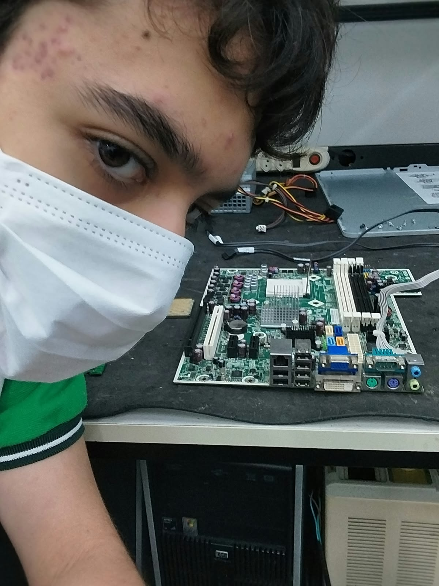
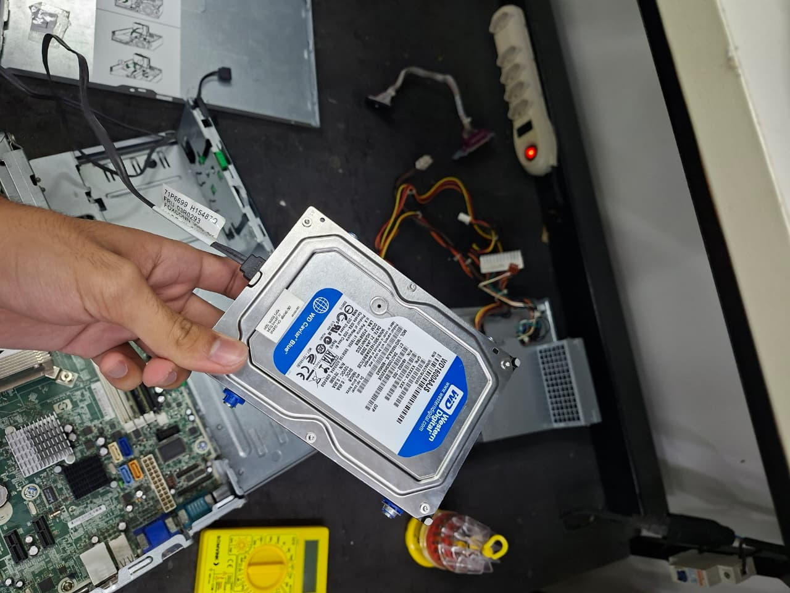
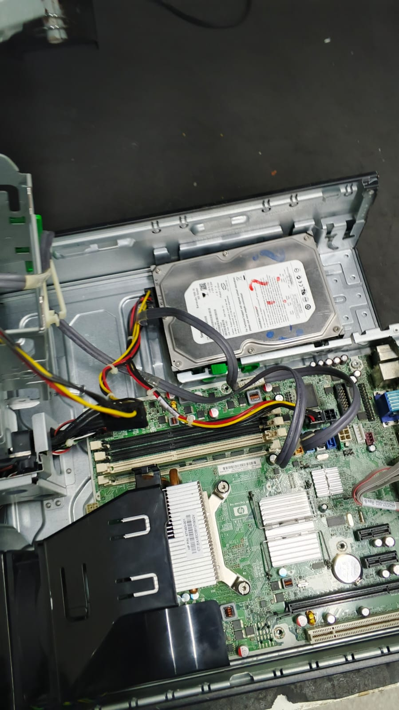

# Anatomia de um PC · Tutorial de Desmontagem e Montagem

> **IFPB · Técnico em Informática · Prática de Hardware**  
> Um guia visual para desmontar e montar um computador desktop com segurança, peça por peça, na ordem certa.

---

### 📊 Visão Geral
* **8** passos de desmontagem
* **7** passos de montagem
* **11** evidências fotográficas

---

## 01 — Introdução

### O que vamos fazer
Esta página documenta a aula prática de desmontagem e montagem de um computador. Aqui estão as ferramentas e os componentes que você vai encontrar pelo caminho.

#### 🧰 Ferramentas Necessárias
* 🪛 **Chave Phillips**: Solta parafusos de painéis, placa-mãe, fonte e unidades.
* 🧤 **Pulseira antiestática**: Descarrega a eletricidade estática do corpo.
* 🔍 **Pinça**: Alcança parafusos pequenos e jumpers.
* 🧴 **Pasta térmica + álcool**: Limpeza e reaplicação no processador.
* 🖌️ **Pincel / ar comprimido**: Remove a poeira acumulada.
* 📦 **Organizador de parafusos**: Separa os parafusos por etapa.
* 📷 **Câmera**: Registra as conexões antes de desmontar.

#### 🧩 Componentes do PC
* 🗄️ **Gabinete**: Estrutura que abriga todos os componentes.
* ⚡ **Fonte (PSU)**: Converte a energia da tomada para o PC.
* 🧩 **Placa-mãe**: Conecta todos os componentes.
* 🧠 **Processador + cooler**: O cérebro do PC e seu resfriamento.
* 💾 **Memória RAM**: Memória rápida de trabalho.
* 💽 **HD / SSD**: Armazenamento de dados.
* 🎮 **Placa de vídeo**: Processamento gráfico (se houver).
* 🔌 **Cabos**: Energia, SATA e painel frontal.

---

## 02 — Segurança

### Antes de abrir o gabinete
*Sete cuidados simples evitam a maior parte dos danos em hardware:*

1. **Desligue e desconecte**: Tire o cabo de energia da tomada e da fonte.
2. **Descarregue a energia**: Com o cabo fora, segure o botão power por alguns segundos.
3. **Bancada adequada**: Limpa, seca e bem iluminada.
4. **Use a pulseira**: Presa a uma parte metálica do gabinete.
5. **Segure pelas bordas**: Nunca toque nos contatos dourados ou chips.
6. **Fotografe tudo**: Registre os cabos antes de removê-los.
7. **Organize os parafusos**: Separe-os por etapa.

---

## 03 — Passo a Passo

### 🔧 Desmontagem

#### PASSO 01: Remover os painéis laterais
Solte os parafusos traseiros (ou as travas) e deslize o painel para trás.
> 💡 **Dica:** Retire os dois lados para ter acesso total ao interior.

#### PASSO 02: Registrar e desconectar os cabos
Fotografe todas as ligações e desconecte alimentação (24 pinos, CPU, SATA, PCIe), dados SATA e painel frontal.
> 💡 **Dica:** Puxe sempre pelo conector, nunca pelo fio.

#### PASSO 03: Retirar as memórias RAM
Abra as travas laterais do slot. O módulo se solta; puxe para cima segurando pelas laterais.

#### PASSO 04: Remover placa de vídeo e placas de expansão
Retire o parafuso do gabinete, solte a trava do slot PCIe e puxe em linha reta.

#### PASSO 05: Retirar HD/SSD e unidade óptica
Solte os parafusos ou trilhos e deslize as unidades para fora do compartimento.

#### PASSO 06: Remover a fonte de alimentação
Solte os 4 parafusos traseiros e retire a fonte pelo interior do gabinete.
> 💡 **Dica:** Cuide para que os cabos não fiquem presos.

#### PASSO 07: Retirar cooler e processador
Desconecte o CPU_FAN, solte o cooler em diagonal, levante a alavanca do soquete e retire o chip sem tocar nos contatos.
> 💡 **Dica:** Limpe a pasta térmica antiga com álcool isopropílico.

#### PASSO 08: Remover a placa-mãe
Retire os parafusos dos suportes (*standoffs*) e levante a placa inclinando levemente.

---

### 🔩 Montagem

#### PASSO 01: Preparar a placa-mãe
Fora do gabinete, instale o processador (alinhe a marcação), a pasta térmica (grão de arroz), o cooler e as memórias RAM até o clique.

#### PASSO 02: Fixar a placa-mãe no gabinete
Confira os *standoffs*, encaixe a placa traseira (*I/O shield*) e parafuse sem apertar demais.

#### PASSO 03: Instalar a fonte
Posicione, alinhe os furos e fixe com os 4 parafusos.

#### PASSO 04: Instalar HD/SSD e unidade óptica
Encaixe nos compartimentos e fixe com parafusos.

#### PASSO 05: Instalar a placa de vídeo
Insira no slot PCIe até o clique da trava e prenda o parafuso no gabinete.
> 💡 **Dica:** Se houver, não esqueça a alimentação extra da placa.

#### PASSO 06: Conectar todos os cabos
Ordem recomendada: 24 pinos → CPU (4/8 pinos) → SATA → painel frontal, conforme o manual da placa-mãe.

#### PASSO 07: Organizar e fechar
Prenda os cabos com abraçadeiras para não atrapalhar o fluxo de ar e recoloque os painéis.

---

## 04 — Teste Final

### Checklist de Validação
- [ ] Todos os cabos conectados corretamente
- [ ] Nenhum parafuso solto dentro do gabinete
- [ ] Cooler fixo e ventoinhas livres
- [ ] Monitor, teclado e cabo de energia conectados
- [ ] Computador liga, passa pelo POST e carrega o sistema

---

## 05 — Dicas e Avisos

### Erros Comuns
* ⛔ **Forçar encaixes**: Se não entra, provavelmente está invertido.
* 🌡️ **Esquecer a pasta térmica**: Causa superaquecimento do processador.
* 🔀 **Painel frontal invertido**: Consulte o manual da placa-mãe.
* 🔩 **Apertar demais**: Pode trincar a placa.

> 🔒 **Privacidade e proteção de dados:**  
> As fotos deste tutorial mostram apenas componentes, ferramentas e mãos executando as tarefas. Nenhum rosto ou dado pessoal foi publicado.

---

**Autores:** Anderson & Levi  
**Curso:** Técnico em Informática · IFPB – Campus João Pessoa · 2026